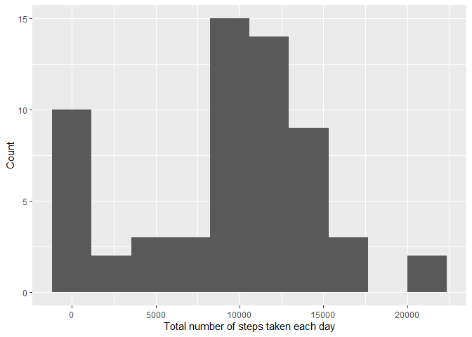
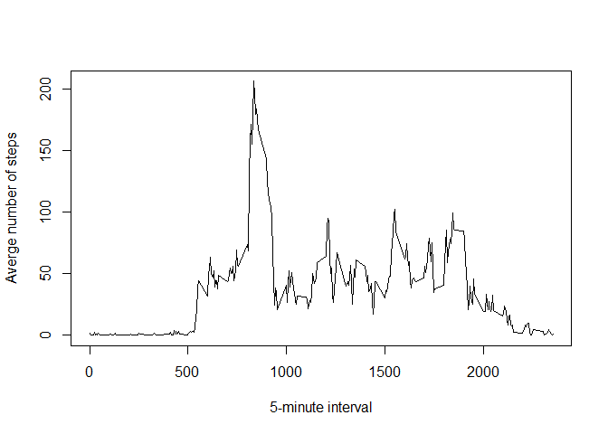
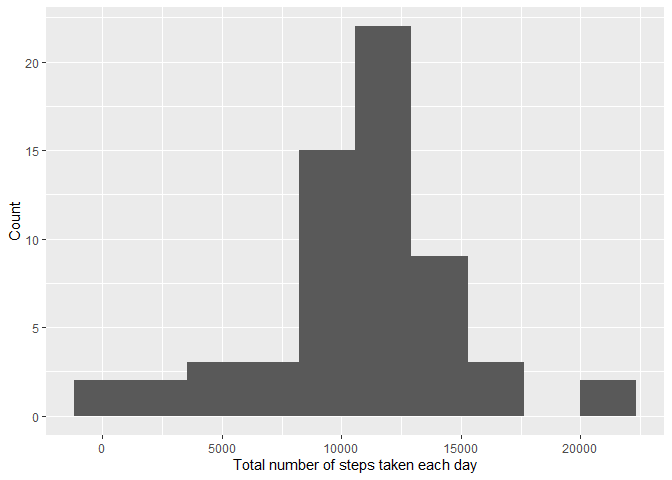
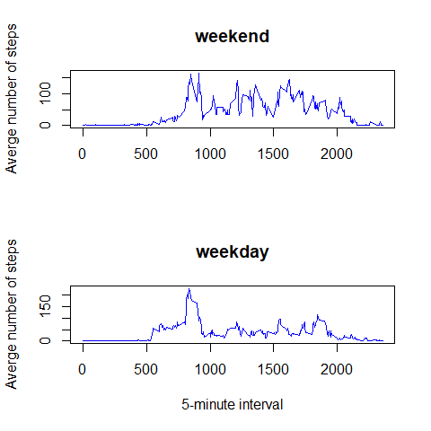

# Peer-graded Assignment: Course Project 1

## 1. Code for reading in the dataset and/or processing the data
Loading and preprocessing the data

- Load the data (i.e. `read.csv()`)
- Process/transform the data (if necessary) into a format suitable for your analysis  


```r
unzip("./activity.zip")
df <- read.csv("./activity.csv", header = TRUE)
df$date <- as.Date(df$date)
str(df)
```

```
## 'data.frame':	17568 obs. of  3 variables:
##  $ steps   : int  NA NA NA NA NA NA NA NA NA NA ...
##  $ date    : Date, format: "2012-10-01" "2012-10-01" ...
##  $ interval: int  0 5 10 15 20 25 30 35 40 45 ...
```

## 2. Histogram of the total number of steps taken each day
What is mean total number of steps taken per day?
For this part of the assignment, you can ignore the missing values in the dataset.

- Calculate the total number of steps taken per day

```r
library(dplyr)
```

```
## 
## Attaching package: 'dplyr'
```

```
## The following objects are masked from 'package:stats':
## 
##     filter, lag
```

```
## The following objects are masked from 'package:base':
## 
##     intersect, setdiff, setequal, union
```

```r
df %>%
        group_by(date) %>% 
        summarise(total_steps = sum(steps, na.rm = TRUE))
```

```
## # A tibble: 61 × 2
##    date       total_steps
##    <date>           <int>
##  1 2012-10-01           0
##  2 2012-10-02         126
##  3 2012-10-03       11352
##  4 2012-10-04       12116
##  5 2012-10-05       13294
##  6 2012-10-06       15420
##  7 2012-10-07       11015
##  8 2012-10-08           0
##  9 2012-10-09       12811
## 10 2012-10-10        9900
## # … with 51 more rows
```

- If you do not understand the difference between a histogram and a barplot, research the difference between them. Make a histogram of the total number of steps taken each day  

```r
library(ggplot2)
df %>% 
        group_by(date) %>% 
        summarise(total_steps = sum(steps, na.rm = TRUE)) %>% 
                ggplot(aes(total_steps)) +
                        geom_histogram(bins = 10) +
                        labs(x = "Total number of steps taken each day",
                             y = "Count")
```

<!-- -->

## 3. Mean and median number of steps taken each day
- Calculate and report the mean and median of the total number of steps taken per day

```r
df1 <- df %>% 
        group_by(date) %>% 
        summarise(total_steps = sum(steps, na.rm = TRUE))
print(paste("The mean and median number of steps taken each day are", 
            round(mean(df1$total_steps)), 
            "and", 
            median(df1$total_steps), 
            "respectively."))
```

```
## [1] "The mean and median number of steps taken each day are 9354 and 10395 respectively."
```

## 4. Time series plot of the average number of steps taken
- Make a time series plot (i.e. `type = "l"`) of the 5-minute interval (x-axis) and the average number of steps taken, averaged across all days (y-axis)  


```r
df2 <- df %>% 
        group_by(interval) %>% 
        summarise(avg_step = mean(steps, na.rm = TRUE))
plot(df2$interval, df2$avg_step, 
     type = "l", 
     xlab = "5-minute interval",
     ylab = "Averge number of steps")
```

<!-- -->

## 5. The 5-minute interval that, on average, contains the maximum number of steps

- Which 5-minute interval, on average across all the days in the dataset, contains the maximum number of steps?  


```r
print(paste("The 5-Minute interval that contained the most steps on average is",
            df2[which.max(df2$avg_step), ]$interval, 
            "with",  
            round(df2[which.max(df2$avg_step), ]$avg_step), 
            "steps."))
```

```
## [1] "The 5-Minute interval that contained the most steps on average is 835 with 206 steps."
```

## 6. Code to describe and show a strategy for imputing missing data
Imputing missing values

- Note that there are a number of days/intervals where there are missing values (coded as 
NA). The presence of missing days may introduce bias into some calculations or summaries of the data.
- Calculate and report the total number of missing values in the dataset (i.e. the total number of rows with NAs)

```r
colSums(is.na(df))
```

```
##    steps     date interval 
##     2304        0        0
```

```r
print(paste("There was", 
            colSums(is.na(df))[1], 
            "rows contained NA."))
```

```
## [1] "There was 2304 rows contained NA."
```

- Devise a strategy for filling in all of the missing values in the dataset. The strategy does not need to be sophisticated. For example, you could use the mean/median for that day, or the mean for that 5-minute interval, etc.
- Create a new dataset that is equal to the original dataset but with the missing data filled in.

```r
df %>% 
        filter(is.na(steps)) %>% 
        group_by(date) %>% 
        count(is.na(steps))
```

```
## # A tibble: 8 × 3
## # Groups:   date [8]
##   date       `is.na(steps)`     n
##   <date>     <lgl>          <int>
## 1 2012-10-01 TRUE             288
## 2 2012-10-08 TRUE             288
## 3 2012-11-01 TRUE             288
## 4 2012-11-04 TRUE             288
## 5 2012-11-09 TRUE             288
## 6 2012-11-10 TRUE             288
## 7 2012-11-14 TRUE             288
## 8 2012-11-30 TRUE             288
```

```r
df3 <- df %>% 
        group_by(interval) %>% 
        mutate(avg_step = mean(steps, na.rm = TRUE))
df3$steps <- as.numeric(df3$steps)
for (i in 1:nrow(df3)) {
      if (is.na(df3[i, "steps"] == TRUE)) {
              df3[i, "steps"] <- df3[i, "avg_step"]
      }
}
head(df3)
```

```
## # A tibble: 6 × 4
## # Groups:   interval [6]
##    steps date       interval avg_step
##    <dbl> <date>        <int>    <dbl>
## 1 1.72   2012-10-01        0   1.72  
## 2 0.340  2012-10-01        5   0.340 
## 3 0.132  2012-10-01       10   0.132 
## 4 0.151  2012-10-01       15   0.151 
## 5 0.0755 2012-10-01       20   0.0755
## 6 2.09   2012-10-01       25   2.09
```
## 7. Histogram of the total number of steps taken each day after missing values are imputed
- Make a histogram of the total number of steps taken each day and Calculate and report the mean and median total number of steps taken per day. Do these values differ from the estimates from the first part of the assignment? What is the impact of imputing missing data on the estimates of the total daily number of steps?


```r
df3 %>% 
        group_by(date) %>% 
        summarise(total_steps = sum(steps, na.rm = TRUE)) %>% 
                ggplot(aes(total_steps)) +
                        geom_histogram(bins = 10) +
                        labs(x = "Total number of steps taken each day",
                             y = "Count")
```

<!-- -->

## 8. Panel plot comparing the average number of steps taken per 5-minute interval across weekdays and weekends
Are there differences in activity patterns between weekdays and weekends?

- For this part the `weekdays()` function may be of some help here. Use the dataset with the filled-in missing values for this part.
- Create a new factor variable in the dataset with two levels – “weekday” and “weekend” indicating whether a given date is a weekday or weekend day.


```r
df4 <- df3 %>% 
        mutate(week_name = weekdays(date))
df4$week_name[df4$week_name == "Saturday"] <- "weekend"
df4$week_name[df4$week_name == "Sunday"] <- "weekend"
df4$week_name[df4$week_name != "weekend"] <- "weekday"
df4$week_name <- as.factor(df4$week_name)
```

- Make a panel plot containing a time series plot (i.e. `type = "l"`) of the 5-minute interval (x-axis) and the average number of steps taken, averaged across all weekday days or weekend days (y-axis). See the README file in the GitHub repository to see an example of what this plot should look like using simulated data.


```r
df4_wd <- df4 %>% 
        filter(week_name == "weekday")
df4_we <- df4 %>% 
        filter(week_name == "weekend")
df4_wd <- df4_wd %>% 
        group_by(interval) %>% 
        summarise(avg_step = mean(steps, na.rm = TRUE))
df4_we <- df4_we %>% 
        group_by(interval) %>% 
        summarise(avg_step = mean(steps, na.rm = TRUE))
par(mfrow = c(2, 1))
plot(df4_we$interval, df4_we$avg_step, 
     type = "l",
     col = "blue",
     xlab = "",
     ylab = "Averge number of steps",
     main = "weekend")
plot(df4_wd$interval, df4_wd$avg_step, 
     type = "l",
     col = "blue",
     xlab = "5-minute interval",
     ylab = "Averge number of steps",
     main = "weekday")
```

<!-- -->

## 9. All of the R code needed to reproduce the results (numbers, plots, etc.) in the report
All the R code needed to reproduced the results are included in the report.
